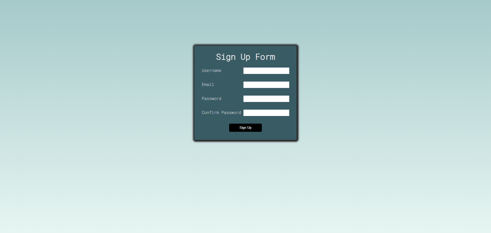

# Complete Form Validation

## Description

a simple signup form with four input fields: username, 
email, password, confirm password and when you click the sign up 
without filling anything or incorrect data, the form will show an error message.

## Tech stack
    - Javascript
    - HTML
    - CSS

## Deployed Link

[Link]()

## Screenshots

